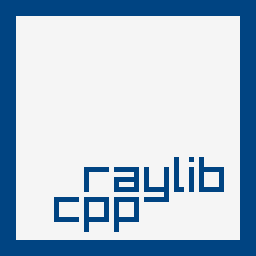

# raylib-cpp [](https://github.com/RobLoach/raylib-cpp/actions?query=workflow%3ATests+branch%3Amaster)

*raylib-cpp* is a C++ wrapper library for [raylib](https://www.raylib.com/), a simple and easy-to-use library to enjoy videogames programming. This C++ header provides object-oriented wrappers around raylib's struct interfaces.

## Example

``` cpp
#include "raylib-cpp.hpp"

int main()
{
	int screenWidth = 800;
	int screenHeight = 450;

	raylib::Window w(screenWidth, screenHeight, "raylib-cpp - basic window");
	raylib::Texture logo("raylib_logo.png");

	SetTargetFPS(60);

	while (!w.ShouldClose())
	{
		BeginDrawing();

		raylib::Color::RayWhite.ClearBackground();

		DrawText("Congrats! You created your first window!", 190, 200, 20, LIGHTGRAY);

		// Object methods.
		logo.Draw(
			screenWidth / 2 - logo.getWidth() / 2,
			screenHeight / 2 - logo.getHeight() / 2);

		EndDrawing();
	}

	// UnloadTexture() and CloseWindow() are called automatically.

	return 0;
}
```

See the [examples folder](examples) for more of the raylib examples that have been ported over to *raylib-cpp*.

## Features

There are a few conventions that raylib-cpp takes on when adopting raylib...

### Constructors

Object constructors load raylib objects.

``` cpp
// raylib
Texture2D texture = LoadTexture("texture.png");

// raylib-cpp
raylib::Texture2D texture("texture.png");
```

### Object Methods

When a raylib method has an object as one of its arguments, you can call the method on the object itself.

``` cpp
// raylib
Vector2 position(50, 50);
DrawPixelV(position, PURPLE);

// raylib-cpp
raylib::Vector2 position(50, 50);
position.DrawPixel(raylib::Color::Purple);

// ... or
raylib::Color::Purple.DrawPixel(position);
```

### Method Names

If a method's name contains an object's name, it is removed from its name to shorten it.

``` cpp
// raylib
DrawTexture(texture, 50, 50, RAYWHITE);

// raylib-cpp
texture.Draw(50, 50, RAYWHITE);
```

### Object Destructors

Objects will attempt to unload their respective raylib resources on destruction. This means no need to call Unload or Close methods. This applies to the window, textures, images, sounds, etc.

``` cpp
// raylib
InitWindow(640, 480, "Hello World");
CloseWindow();

// raylib-cpp
raylib::Window w(640, 480, "Hello World");
// CloseWindow(); // w.Close() is automatically called when the object is destructed.
```

### Property Get/Set

Properties can be assigned through getter and setter methods. You still have access to the internal properties, however.

``` cpp
// raylib
Vector2 position;
position.x = 50;
position.y = 100;

// raylib-cpp
raylib::Vector2 position;
position.SetX(50);
position.SetY(100);

// ... or
position.x = 50;
position.y = 100;
```

### Method Overrides

Many similar raylib method names have different name suffixes based on what arguments they take. With raylib-cpp, these cases use [method overriding](https://en.wikipedia.org/wiki/Method_overriding) to allow using the same method names.

``` cpp
// raylib
Color color = GRAY;
DrawPixel(50, 50, color);
Vector2 position = {50.0f, 50.0f};
DrawPixelV(position, color); // Extra V in method name.

// raylib-cpp
raylib::Color color = raylib::Color::Gray;
color.DrawPixel(50, 50);
Vector2 position(50.0f, 50.0f);
color.DrawPixel(position); // No more V in method name.
position.DrawPixel(color); // Alternatively
```

### Method Chaining

When there's a method that doesn't return anything, it'll instead return the object itself, allowing [method chaining](https://en.wikipedia.org/wiki/Method_chaining).

``` cpp
// raylib
Image cat = ImageLoad("cat.png");
ImageCrop(&cat, (Rectangle){ 100, 10, 280, 380 });
ImageFlipHorizontal(&cat);
ImageResize(&cat, 150, 200);

// raylib-cpp
raylib::Image cat("cat.png");
cat.Crop((Rectangle){ 100, 10, 280, 380 })
   .FlipHorizontal()
   .Resize(150, 200);
```

### Operators

There are operator overrides for objects.

``` cpp
// raylib
Vector2 position = {50, 50};
Vector2 speed = {10, 10};
position.x += speed.x;
position.y += speed.y;

// raylib-cpp
raylib::Vector2 position(50, 50);
raylib::Vector2 speed(10, 10);
position += speed; // Addition assignment operator override.
```

### RayMath

The [raymath](https://github.com/raysan5/raylib/blob/master/src/raymath.h) methods are included.

``` cpp
// raylib
Vector2 direction = {50, 50};
Vector2 newDirection = Vector2Rotate(direction, 30);

// raylib-cpp
raylib::Vector2 direction(50, 50);
raylib::Vector2 newDirection = direction.Rotate(30);
```

## Getting Started

*raylib-cpp* is a header-only library. This means in order to use it, you must link your project to [raylib](https://www.raylib.com/), and then include [`include/raylib-cpp.hpp`](raylib-cpp/include/raylib-cpp.hpp).

1. Set up a *raylib* project using the [build and install instructions](https://github.com/raysan5/raylib#build-and-installation)
2. Download *raylib-cpp*
3. Include [`raylib-cpp.hpp`](include/raylib-cpp.hpp)
    ``` cpp
    #include "path/to/raylib-cpp.hpp"
    ```

### Starter Projects

The [projects directory](projects) includes some starter templates...

- [CMake template](projects/CMake)

If there's a project template you would like to see added, feel free to [make an issue](https://github.com/RobLoach/raylib-cpp/issues) and we can add it in.

## Development

*raylib-cpp* uses [CMake](https://cmake.org) as a primary target for development. To build it, and run the tests or examples, use...

``` bash
git clone https://github.com/RobLoach/raylib-cpp.git
cd raylib-cpp
git submodule update --init
mkdir build
cd build
cmake ..
make
make test
./examples/core_basic_window
```

## Documentation

To build the document with [Doxygen](http://www.doxygen.nl/), use...

```
doxygen projects/Doxygen/Doxyfile
```

### Defines

- `RAYLIB_CPP_NO_MATH` - When set, will skip adding the `raymath.h` integrations
